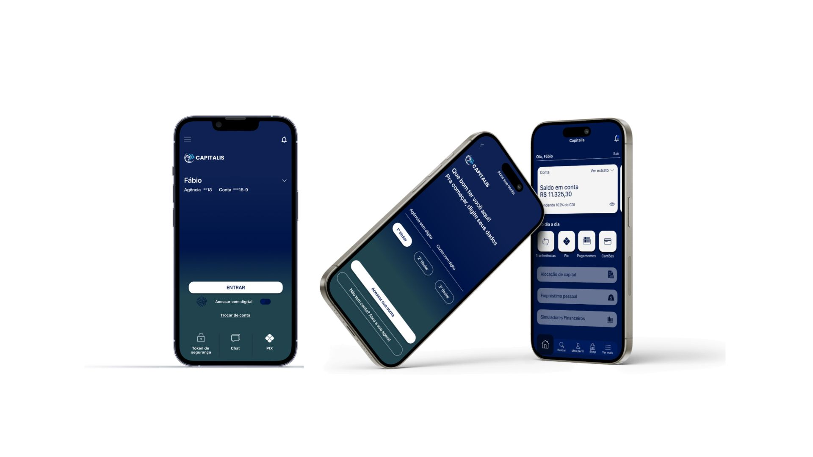
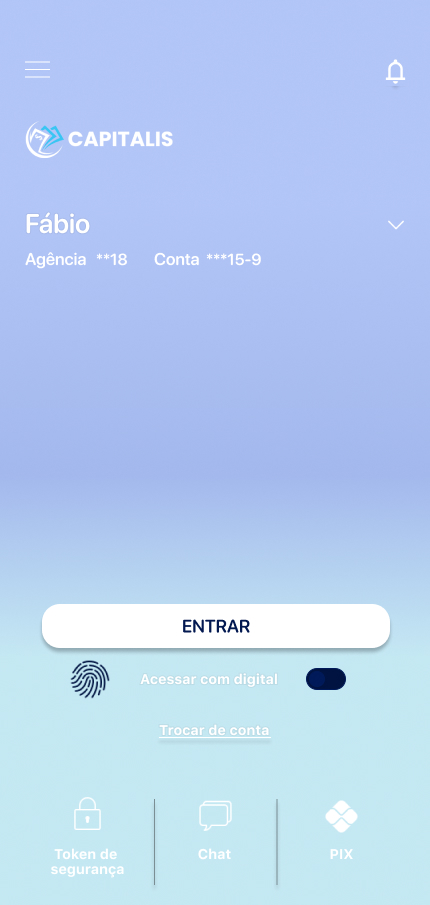
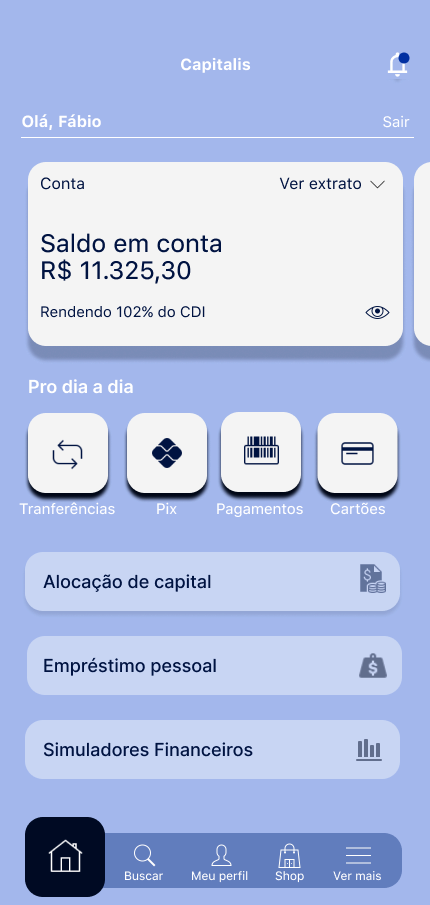

# 🏦 Banco Capitalis - Mobile Banking Interface

  <!-- Imagem de capa do projeto (o mockup com os 3 celulares) -->
  

## 📌 Sobre o Projeto
Este repositório apresenta um protótipo de alta fidelidade desenvolvido para o **Banco Capitalis**, focado em uma experiência mobile fluida, moderna e segura para serviços bancários essenciais feito para um projeto em grupo da faculdade.

## 🎨 Fluxo de Telas (UI/UX)

Para garantir uma interface limpa e intuitiva, mapeamos as principais interações do aplicativo:

### 1. Autenticação e Acesso
| Tela de Boas-Vindas | Identificação da Conta |
| :---: | :---: |
|  |  |

### 2. Área Logada (Dashboard)
Abaixo está o design do painel principal, centralizando as funções do dia a dia do usuário, como Pix, extrato e investimentos.

  

